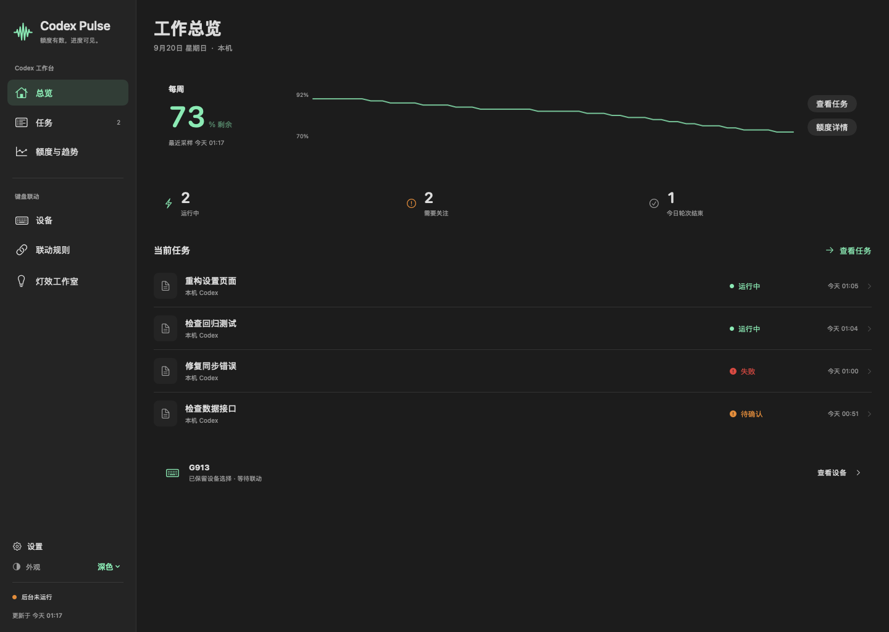
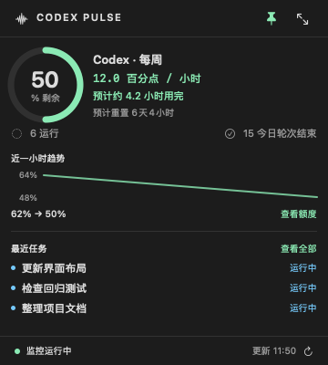
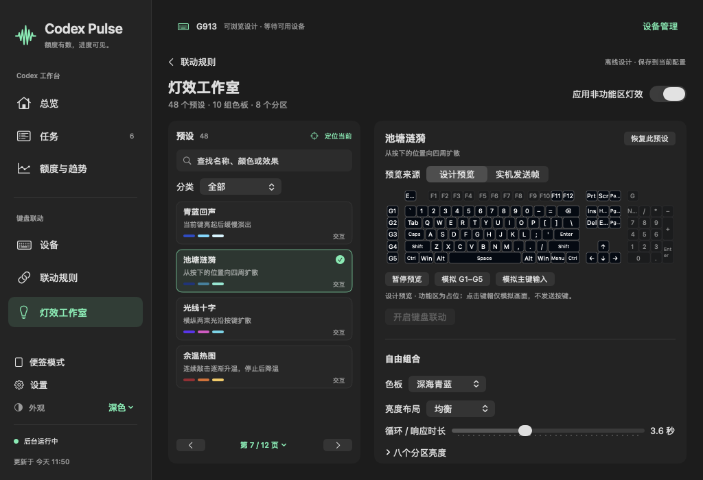

<a id="english"></a>

# Codex Pulse

[](#english)
[](#中文)

[](https://github.com/QiushanHuang/Codex-Pulse/releases)
[](https://github.com/QiushanHuang/Codex-Pulse/actions/workflows/ci.yml)
[](https://github.com/QiushanHuang/Codex-Pulse/releases/latest)
[](https://github.com/QiushanHuang/Codex-Pulse/releases/latest)
[](LICENSE)


**Keep track of Codex while you work, with fewer window switches.**
Codex Pulse is a native macOS companion that keeps background work visible in the
menu bar, a pinnable card and, optionally, a compatible keyboard.

## Why Codex Pulse

Keep writing code or reading while Codex runs in the background. Pulse shows running
tasks, items needing attention and remaining quota alongside your work. Open the
workbench when you want details, or use the menu bar and sticky card for a quick check.

| Common approach | Where it gets in the way | How Pulse helps |
| --- | --- | --- |
| Reopen Codex to check on background work | Repeated window switching interrupts the task in front of you | Glance at the menu bar or pin a compact status card above your other windows |
| Check a remaining-quota percentage | A number alone gives little context about consumption or the next reset | See remaining quota, reset times, a one-hour trend and a consumption estimate together |
| Check several task windows separately | It takes more effort to see what is running and what needs attention | Search and filter the latest 30 local unarchived tasks, then jump back to the relevant task |
| Use a decorative keyboard preset | The lighting does not tell you about your Codex work | Turn a supported G913 into a quota bar, running-task display and completion/reset signal |

Use the workbench to review tasks and quota together, then switch to the sticky card
to keep them nearby. Add keyboard signals when you want an at-a-glance desk display;
the workbench is also available on its own.

## Everyday use

- **Work in an editor or browser while a task runs.** Keep the sticky card nearby and
  return to Codex when a turn ends or a task needs attention.
- **Plan your next stretch of work.** Check remaining quota, its recent consumption
  and the next reset before deciding what to run next. The time estimate updates as
  your usage changes.
- **Make a desk setup useful.** Give a compatible keyboard meaningful work signals,
  then personalize the remaining regions with 48 presets, 10 palettes and eight zones.

Native SwiftUI interface · Local settings and history · Optional keyboard linking ·
Python and Node.js included in the download.

**[Download for Apple Silicon](https://github.com/QiushanHuang/Codex-Pulse/releases/latest)**
· [Read the quick-start guide](#start-here)



*Screenshots show example data. The app interface is in Chinese; English and Chinese
operating guides are available.*

## Install

Download **`Codex-Pulse-v2.1.3-macos-arm64.dmg`** from
[Releases](https://github.com/QiushanHuang/Codex-Pulse/releases/latest), open it and drag
**Codex Pulse.app** to **Applications**. A ZIP containing the same app is also available.
**Python and Node.js come bundled with the app.**

| Requirement | Details |
| --- | --- |
| Mac | Apple Silicon; macOS 14 or newer |
| Codex | A signed-in Codex desktop installation in `/Applications` or `~/Applications`, or a `codex` CLI visible to the app |
| Keyboard lighting, optional | Logitech G HUB running; G913 full-size over LIGHTSPEED or USB; onboard memory mode off |
| Reactive typing effects, optional | macOS Input Monitoring permission for Codex Pulse |

**First launch:** this release uses ad-hoc signing and has not been notarized by Apple.
If macOS blocks it, verify the download, then use **System Settings → Privacy & Security →
Open Anyway** if offered. Follow the [installation guide](docs/troubleshooting.md)
for the full steps.

To verify a downloaded archive, download `SHA256SUMS.txt` from the same release and run:

```sh
shasum -a 256 Codex-Pulse-v2.1.3-macos-arm64.dmg
```

Compare the result with the matching line in `SHA256SUMS.txt`.
The download is for Apple Silicon. Intel users can review the
[source-build requirements](docs/building.md); Intel builds have not yet been tested.

## Start here

1. Open Codex and sign in, then launch **Codex Pulse**.
2. Open **总览** (Overview) or **额度与趋势** (Quota & Trends). Quota is sampled every
   60 seconds; task events are checked every 5 seconds.
3. Open **任务** (Tasks) to search, filter and return to a task in Codex.
4. Choose **便签模式** (Sticky Mode), or press **⌘⇧M**. Pin the card with its pin button.
   Switch back to the workbench for details; monitoring continues as you change views.
5. Open **设置** (Settings) with **⌘,** for appearance, monitoring, privacy diagnostics
   and widget guidance. Turn off **在 Dock 中显示** in General settings to hide
   the Dock icon while keeping the menu-bar entry. Use **⌘H** or **隐藏 Codex Pulse** in the Dock/menu-bar menu
   to hide the app while monitoring continues. Click its Dock icon to restore the
   last dashboard or sticky view, including after closing its window. Quit stops monitoring.

<p align="center"></p>

Add Codex Pulse through macOS **Edit Widgets** for small, medium or large widgets.
macOS schedules widget refreshes. Check the widget's update time, or open the app for
the latest collected data.
For login startup, add the installed app in **System Settings → General → Login Items**.

## Connect a keyboard

Connect a **full-size G913** over LIGHTSPEED or USB and start G HUB. Open
**键盘联动 → 设备** (Keyboard → Devices), select the keyboard, then enable linking in
**联动规则** (Linking Rules). The device list shows compatibility alongside each model.
G915 is listed as unverified; lighting control is currently available for the G913
full-size layout.

| Region / signal | Meaning |
| --- | --- |
| F1–F10 | Lowest remaining quota among the main Codex windows; 10% per key, with a partial last segment |
| Keyboard logo | Low mint when healthy; steady red at 25% or below, with a separate alert switch |
| Numeric keypad | Distinct running patterns for one, two, three, or four-plus active tasks |
| Green completion sequence | A task turn has ended; return to Codex to review the result |
| Purple reset sequence | A quota-window reset has been detected |
| Gray quota indicators | Missing or stale data |

The **灯效工作室** (Lighting Studio) has search, categories, pagination, independent
zone brightness and editable timing. Browse presets, then click one to apply it.
Use **设计预览** (Design Preview) to try effects offline, or **实机发送帧** (Sent Frames)
to inspect colors sent to the keyboard. Adjust brightness while looking at the keyboard
to find a comfortable level.



Turning linking off or quitting Pulse returns lighting control to G HUB, with your
saved profiles and key assignments preserved. Set idle dimming and sleep in Pulse to
adjust the keyboard's power-saving behavior.

For effects that respond to typing, enable ordinary keyboard input and grant macOS
Input Monitoring permission. These effects use ordinary keys; physical G1–G5 presses
are not currently detected. If effects stop working after an app or G HUB update,
check [troubleshooting](docs/troubleshooting.md). The [user guide](docs/user-guide.md)
covers demos, permissions, recovery and updates.

## Quota, tasks and local data

- **Quota and resets:** Pulse reads your account's quota through the installed Codex
  App Server using your existing sign-in. An internet connection is needed. Each quota
  window shows its own duration and reset time; Spark appears separately when available.
  Checking quota uses no model turns or reset credits.
- **Consumption and time remaining:** after five minutes of continuous samples, Pulse
  estimates usage in **quota percentage points per hour**. The estimate follows recent
  consumption and starts fresh after a reset, account change or long connection gap.
- **Task status:** the list shows the latest 30 unarchived sessions on this Mac. Use
  their respective apps for remote tasks and ChatGPT conversations. A task marked **待确认**
  (Needs confirmation) needs a closer look in Codex because its recent events are
  insufficient to determine the current state.
- **Local history:** settings, 30 days of quota history, task titles/status, event
  summaries and lighting recovery records are saved in
  `~/Library/Application Support/CodexPulse/`. Conversation bodies and login tokens
  are not copied. Typing effects keep up to 64 key events for eight seconds in memory;
  typed text is not saved to disk.

## Build and contribute

Source builds need macOS 14+, full Xcode, Python 3.9+ and Node.js 22+.
There are no application-level pip or npm dependencies.

```sh
git clone https://github.com/QiushanHuang/Codex-Pulse.git
cd Codex-Pulse
python3 scripts/build_macos.py
open "build/Codex Pulse.app"
```

Quit an app running from `build/` before rebuilding it. Local builds use external
runtimes and ad-hoc signing by default. See [building and packaging](docs/building.md)
for SDK selection, the complete test commands, embedded runtimes and signing.

[User guide](docs/user-guide.md) · [Troubleshooting](docs/troubleshooting.md) ·
[Contributing](CONTRIBUTING.md) · [Changelog](CHANGELOG.md) ·
[v2.1.3 release notes](docs/releases/v2.1.3.md)

Created and maintained by **[Qiushan (QiushanHuang)](https://github.com/QiushanHuang)**.
See [contributors and attribution](CONTRIBUTORS.md). Source code and original artwork
use the [MIT License](LICENSE); bundled runtimes retain their
[third-party licenses](THIRD_PARTY_NOTICES.md).

---

<a id="中文"></a>

## 中文

[](#english)
[](#中文)


**把 Codex 的额度、任务状态与键盘提示放在一起，少切几次窗口。**
Codex Pulse 是原生 macOS 辅助工作台，让后台工作的状态出现在菜单栏、可置顶便签，
以及可选的兼容键盘上。

### 选择 Codex Pulse 的理由

Codex 在后台运行时，你可以继续写代码、读文档。Pulse 在旁边显示运行中的任务、
需要关注的状态和剩余额度。想了解详情时打开工作台，平时看一眼菜单栏或便签就够了。

| 常见做法 | 使用中的不便 | Pulse 如何改善 |
| --- | --- | --- |
| 反复打开 Codex 查看后台状态 | 来回切换窗口，打断正在做的事 | 菜单栏快速查看，或把紧凑便签置顶在其他窗口上方 |
| 只看一个剩余额度百分比 | 难以同时判断消耗速度和下次重置时间 | 在一起查看剩余额度、重置时间、近一小时趋势和消耗估计 |
| 分别打开多个任务确认进展 | 不容易快速找到运行中或需要关注的任务 | 集中搜索、筛选本机最近 30 个未归档任务，再跳回对应任务 |
| 使用装饰性的键盘灯效 | 灯效与 Codex 的任务状态分开显示 | 让兼容 G913 显示额度条、运行任务动画，以及结束和重置提示 |

在工作台集中查看任务和额度，切换到便签后继续处理手头的工作。
想让桌面上的键盘也显示状态，可以开启灯光联动；工作台也支持单独使用。

### 日常使用场景

- **任务在跑，你继续写代码或看资料。** 把便签放在旁边，看到轮次结束或需要关注的状态后，
  再回到 Codex 处理。
- **开始下一段工作前，先看看额度。** 同时查看剩余额度、近期消耗和重置时间，帮助安排下一步。
  预计剩余时间会随近期用量变化更新。
- **让桌面上的键盘多一点用途。** 用灯光表示工作状态，再用 48 个预设、10 组色板和八区亮度
  调整其他区域，把状态提示与日常配色放在同一套设置里。

原生 SwiftUI 界面 · 配置与历史本地保存 · 键盘联动可选 · 下载包内置 Python 与 Node.js。

**[下载 Apple Silicon 版本](https://github.com/QiushanHuang/Codex-Pulse/releases/latest)**
· [查看快速开始](#快速开始)


*截图使用示例数据。应用界面为中文，操作指南提供中英版本。*

### 安装

前往 [Releases](https://github.com/QiushanHuang/Codex-Pulse/releases/latest)，下载
**`Codex-Pulse-v2.1.3-macos-arm64.dmg`**，打开后把 **Codex Pulse.app** 拖到
**Applications（应用程序）**。也提供包含同一应用的 ZIP。
**下载包已内置 Python 与 Node.js**，复制到应用程序目录后即可启动。

| 条件 | 说明 |
| --- | --- |
| Mac | Apple Silicon，macOS 14 及以上 |
| Codex | 安装在 `/Applications` 或 `~/Applications` 并已登录的 Codex 桌面应用；或应用可找到的 `codex` CLI |
| 键盘联动（可选） | G HUB 正在运行，完整布局 G913 通过 LIGHTSPEED 或 USB 连接，关闭板载模式 |
| 普通按键交互（可选） | 为 Codex Pulse 授予 macOS 输入监控权限 |

**首次打开：**当前版本使用 ad-hoc 签名，尚未经过 Apple 公证。
如果 macOS 阻止打开，核对下载文件后，在 **系统设置 → 隐私与安全性** 中选择系统提供的
**仍要打开**。完整步骤见[安装指南](docs/troubleshooting.md#中文)。

从同一 Release 下载 `SHA256SUMS.txt`，执行以下命令并与对应行比较：

```sh
shasum -a 256 Codex-Pulse-v2.1.3-macos-arm64.dmg
```

下载包适用于 Apple Silicon。Intel 用户可查看[源码构建要求](docs/building.md#中文)，目前尚未完成 Intel 构建测试。

### 快速开始

1. 打开并登录 Codex，然后启动 **Codex Pulse**。
2. 在 **总览** 或 **额度与趋势** 查看数据；额度每 60 秒采样，任务事件每 5 秒检查。
3. 在 **任务** 搜索、筛选，点击相应入口回到 Codex。
4. 选择 **便签模式** 或按 **⌘⇧M**，用图钉切换置顶。需要详情时切回工作台，
   切换视图期间监控继续运行。
5. 按 **⌘,** 打开 **设置**，管理外观、监控、隐私诊断与小组件说明。
   在通用设置中关闭 **在 Dock 中显示**，可隐藏 Dock 图标并保留菜单栏入口。
   按 **⌘H**，或在 Dock／菜单栏菜单选择 **隐藏 Codex Pulse**，
   可隐藏应用并继续监控。点击 Dock 图标可恢复上次使用的工作台或便签，关闭窗口后也能重新打开。
   选择退出后后台停止。

<p align="center"></p>

在 macOS **编辑小组件** 中搜索 Codex Pulse，可添加小、中、大三种尺寸。
macOS 会安排小组件的刷新时间；留意“更新于”时间，或打开应用查看最新采集的数据。
需要开机启动时，在 **系统设置 → 通用 → 登录项** 中添加安装后的应用。

### 连接键盘

通过 LIGHTSPEED 或 USB 连接 **完整布局 G913**，并启动 G HUB。
进入 **键盘联动 → 设备** 选择键盘，再到 **联动规则** 开启联动。
设备列表会显示各型号的兼容状态：当前开放完整布局 G913 的灯光控制，G915 标为尚未验证。

| 区域或提示 | 含义 |
| --- | --- |
| F1–F10 | 主 Codex 窗口中最低剩余额度，每键 10%，最后一格按比例调暗 |
| 键盘 Logo | 正常为低亮薄荷绿；≤25% 为红色常亮，可单独关闭提醒 |
| 数字小键盘 | 分别显示 1、2、3、4 个及以上运行任务的动画 |
| 绿色结束动画 | 本轮任务已结束，可以回到 Codex 查看结果 |
| 紫色重置动画 | 检测到额度窗口重置 |
| 灰色额度提示 | 数据缺失或已过期 |

在 **灯效工作室** 搜索或翻页浏览预设，点击喜欢的效果即可应用，再调整分区亮度与时长。
用 **设计预览** 离线试效果，用 **实机发送帧** 查看发送给键盘的颜色。
调整亮度时，结合眼前键盘的实际效果选择舒适的亮度。


关闭联动或退出 Pulse 后，灯光交回 G HUB，原有配色方案与按键分配保留。
在 Pulse 中设置空闲降亮和休眠，可调整键盘的省电行为。

需要灯效响应打字时，开启普通按键响应，并授予 macOS 输入监控权限。
交互效果由普通按键触发，实体 G1–G5 独立按下事件目前尚不支持。
如果更新应用或 G HUB 后灯效停止响应，可按[排障说明](docs/troubleshooting.md#中文)检查。
演示、授权、恢复和更新步骤见[操作指南](docs/user-guide.md#中文)。

### 额度、任务与本地数据

- **额度与重置：**通过已安装 Codex 的 App Server 和现有登录状态联网查询。
  各额度窗口分别显示周期与重置时间，Spark 可用时单独展示。查询额度不消耗模型轮次或重置券。
- **消耗速度与剩余时间：**连续采样五分钟后，按 **额度百分点／小时** 估计近期消耗。
  预计剩余时间随用量更新；重置、切换账户或长时间断线后重新积累样本。
- **任务状态：**列表显示这台 Mac 上最近 30 个未归档会话，远程任务与 ChatGPT 对话请在
  对应应用中查看。出现 **待确认** 时，表示近期事件不足以判断当前状态，可以打开对应任务检查。
- **本地记录：**配置、30 天额度历史、任务标题与状态、事件摘要和灯光恢复记录保存在
  `~/Library/Application Support/CodexPulse/`。会话正文与登录令牌不会被复制。
  打字灯效在内存中暂存最多 64 项、8 秒内的按键事件，输入文本不写入磁盘。

### 源码构建与贡献

需要 macOS 14+、完整 Xcode、Python 3.9+、Node.js 22+；应用无需额外 pip/npm 依赖。

```sh
git clone https://github.com/QiushanHuang/Codex-Pulse.git
cd Codex-Pulse
python3 scripts/build_macos.py
open "build/Codex Pulse.app"
```

若正在运行 `build/` 中的应用，请先退出再构建。本地构建默认使用外部解释器与 ad-hoc 签名。
SDK 选择、完整测试命令、运行时打包及签名见[构建说明](docs/building.md#中文)。

[操作指南](docs/user-guide.md#中文) · [常见问题](docs/troubleshooting.md#中文) ·
[贡献指南](CONTRIBUTING.md) · [更新记录](CHANGELOG.md) ·
[v2.1.3 发布说明](docs/releases/v2.1.3.md)

作者与维护者：**[Qiushan（QiushanHuang）](https://github.com/QiushanHuang)**。
贡献署名见 [CONTRIBUTORS.md](CONTRIBUTORS.md)。源码与原创图形采用 [MIT 许可](LICENSE)，
内置运行时保留各自的[第三方许可](THIRD_PARTY_NOTICES.md)。

[↑ Back to English / 返回英文](#english)
